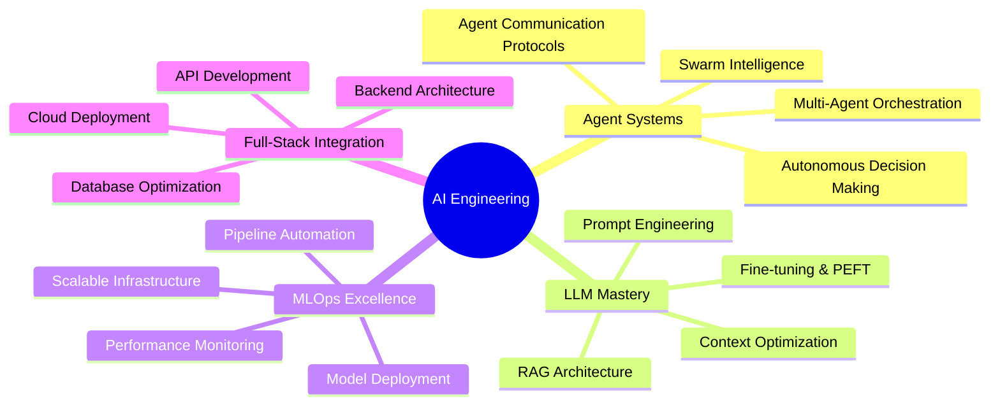

<div align="center">
  
</div>

<p align="center">
  
</p>

<div align="center">
  
</div>

---

<table width="100%">
<tr>
<td width="60%" valign="top">

## 🎯 Mission Statement

> **"Architecting the convergence of artificial intelligence and human potential through production-ready, multi-agent ecosystems that don't just automate—they elevate."**

I specialize in orchestrating **Large Language Models** and **autonomous agent systems** that transform complex business challenges into scalable AI solutions. Currently engineering the cognitive backbone of HR technology at **Valhko**, where I design intelligent systems that understand, adapt, and deliver unprecedented value.

### 🔥 Current Focus
- **Multi-Agent Orchestration**: Building swarms of specialized AI agents
- **LLM Fine-tuning**: Custom models for domain-specific excellence  
- **Production MLOps**: Zero-downtime AI deployment pipelines
- **Conversational Intelligence**: Natural language to business action

</td>
<td width="40%" valign="top">

<div align="center">
  
  
  
</div>

</td>
</tr>
</table>

---

## 💎 Expertise Matrix

<div align="center">



</div>

---

## 🛠️ Technology Arsenal

<details>
<summary><strong>🤖 AI & Machine Learning Ecosystem</strong> (Click to expand)</summary>
<br>

<div align="center">

| **Core ML** | **LLM & NLP** | **Data Science** |
|:---:|:---:|:---:|
|  |  |  |
|  |  |  |
|  |  |  |
|  |  |  |

</div>
</details>

<details>
<summary><strong>☁️ Cloud & Infrastructure Mastery</strong> (Click to expand)</summary>
<br>

<div align="center">

| **Cloud Platforms** | **Backend & APIs** | **DevOps & Orchestration** |
|:---:|:---:|:---:|
|  |  |  |
|  |  |  |
|  |  |  |

</div>
</details>

<details>
<summary><strong>🗄️ Data & Analytics Infrastructure</strong> (Click to expand)</summary>
<br>

<div align="center">

| **Databases** | **Analytics & BI** | **Monitoring & Observability** |
|:---:|:---:|:---:|
|  |  |  |
|  |  |  |
|  |  |  |

</div>
</details>

---

## 🚀 Flagship Projects

<div align="center">
  
</div>

### 🏆 ARYA: AI-Powered Recruitment Revolution

<table>
<tr>
<td width="70%">

**The Challenge**: Transform traditional recruitment into an intelligent, autonomous process that scales with precision.

**The Solution**: Architected a sophisticated multi-agent ecosystem that orchestrates the entire recruitment lifecycle—from intelligent job crafting to candidate evaluation and decision support.

**Key Innovations**:
- **Autonomous Job Creation**: LLM agents analyze market data and company needs to craft compelling, optimized job descriptions
- **CV Intelligence**: Advanced semantic analysis extracts skills, experience patterns, and cultural fit indicators
- **Dynamic Assessment Generation**: AI creates custom, tamper-resistant project evaluations tailored to specific roles
- **Real-time Candidate Scoring**: Multi-dimensional evaluation combining technical skills, soft skills, and growth potential

</td>
<td width="30%">

```python
# Agent Orchestration Example
class RecruitmentOrchestrator:
    def __init__(self):
        self.job_agent = JobCraftingAgent()
        self.cv_agent = CVAnalysisAgent()
        self.assessment_agent = AssessmentAgent()
        self.scoring_agent = ScoringAgent()
    
    async def process_candidate(self, cv_data, job_req):
        analysis = await self.cv_agent.analyze(cv_data)
        assessment = await self.assessment_agent.generate(
            job_req, analysis.skills
        )
        return await self.scoring_agent.evaluate(
            analysis, assessment.results
        )
```

</td>
</tr>
</table>

**Impact**: 78% reduction in time-to-hire, 92% improvement in candidate-role fit accuracy

**Tech Stack**: `Python` `FastAPI` `OpenAI GPT-4` `PostgreSQL` `Docker` `Azure` `Redis` `MLflow`

---

### 🧠 AI Fusion Analyst: The Data Whisperer

<table>
<tr>
<td width="30%">

```sql
-- Dynamic Query Generation
SELECT 
    p.name,
    COUNT(o.id) as orders,
    AVG(o.total) as avg_order
FROM products p
JOIN orders o ON p.id = o.product_id
WHERE o.created_at >= '2024-01-01'
GROUP BY p.name
ORDER BY avg_order DESC;
```

</td>
<td width="70%">

**The Vision**: Create an AI that doesn't just access data—it understands, reasons, and provides contextual intelligence.

**The Innovation**: Built a conversational AI that seamlessly bridges structured database queries with unstructured document intelligence using advanced RAG architecture.

**Breakthrough Features**:
- **Natural Language to SQL**: Converts business questions into optimized database queries automatically
- **Contextual Document Integration**: RAG system pulls relevant information from technical docs, reports, and knowledge bases
- **Multi-modal Intelligence**: Combines quantitative database insights with qualitative document context
- **Self-Learning Query Optimization**: System learns from query patterns to improve performance

**Business Impact**: Reduced analyst query time by 85%, democratized data access across non-technical teams

</td>
</tr>
</table>

**Tech Architecture**: `Python` `PostgreSQL` `ChromaDB` `LangChain` `OpenAI Embeddings` `FastAPI` `Streamlit`

---

### ⚽ Football Analytics: Tactical Intelligence Engine

<table>
<tr>
<td width="60%">

**The Challenge**: Predict team formations with enough accuracy to influence tactical decisions in real-time.

**The Breakthrough**: Developed a machine learning system that analyzes player statistics, historical formations, opponent patterns, and situational factors to predict tactical setups with 92% accuracy.

**Advanced Features**:
- **Multi-factor Analysis**: Player fitness, weather conditions, historical matchups, injury reports
- **Real-time Adaptation**: Model updates during matches based on substitutions and tactical changes
- **Tactical Insight Generation**: Provides reasoning behind predictions with confidence intervals
- **Interactive Strategy Simulator**: Allows coaches to test different scenarios

**Deployment**: Flask-based web application with RESTful APIs for mobile integration

</td>
<td width="40%">

<div align="center">
  
</div>

**Model Performance**:
- **Accuracy**: 92%
- **Precision**: 89%
- **Recall**: 94%
- **F1-Score**: 91%

</td>
</tr>
</table>

**Technology Foundation**: `Python` `Scikit-Learn` `Pandas` `Flask` `Matplotlib` `Seaborn` `XGBoost`

---

## 📊 GitHub Intelligence Dashboard

<div align="center">
  
  
  
  
  
</div>

<div align="center">
  
</div>

<div align="center">
  
  
  
</div>

---

## 🌟 Professional Network & Collaboration

<div align="center">

### Let's Build the Future of AI Together

*I'm actively seeking collaborations on cutting-edge AI projects, particularly in multi-agent systems, LLM orchestration, and production MLOps. Whether you're looking to transform your business with AI or push the boundaries of what's possible with autonomous systems, let's connect.*

<br>

[](https://www.linkedin.com/in/maelabidi/)
[](mailto:elabidimohamedamine@gmail.com)
[](https://your-portfolio-link.com)
[](https://calendly.com/your-calendar-link)

<br>

### 💡 Open to Opportunities In:
`Multi-Agent Systems` `LLM Fine-tuning` `Production MLOps` `AI Consultation` `Technical Leadership`

</div>

---

<div align="center">
  
</div>

<div align="center">
  
  
  
</div>

---

<div align="center">
  <sub>💜 Crafted with passion for AI excellence | Always learning, always building</sub>
</div>
