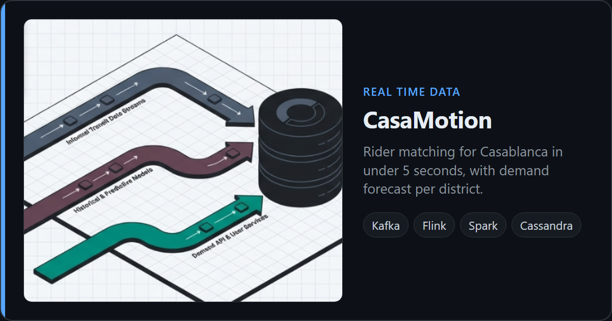
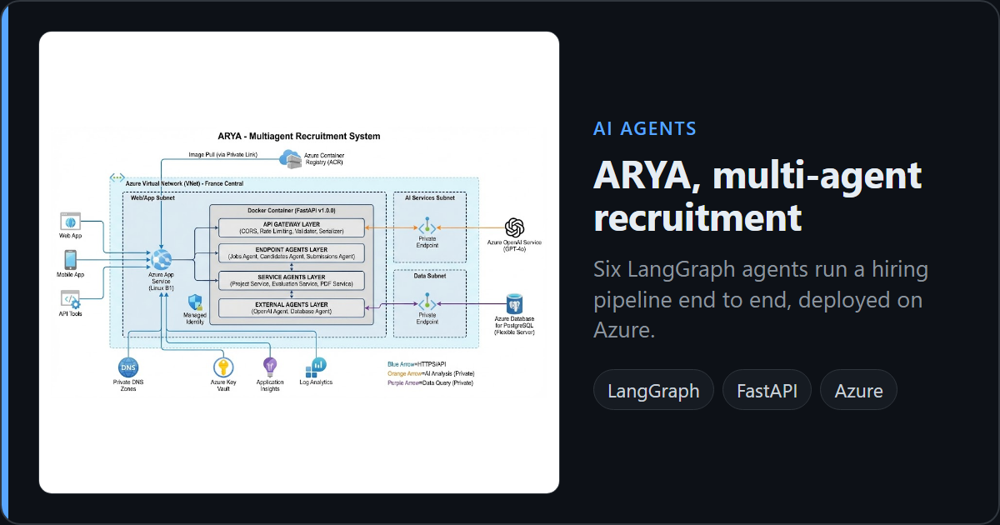
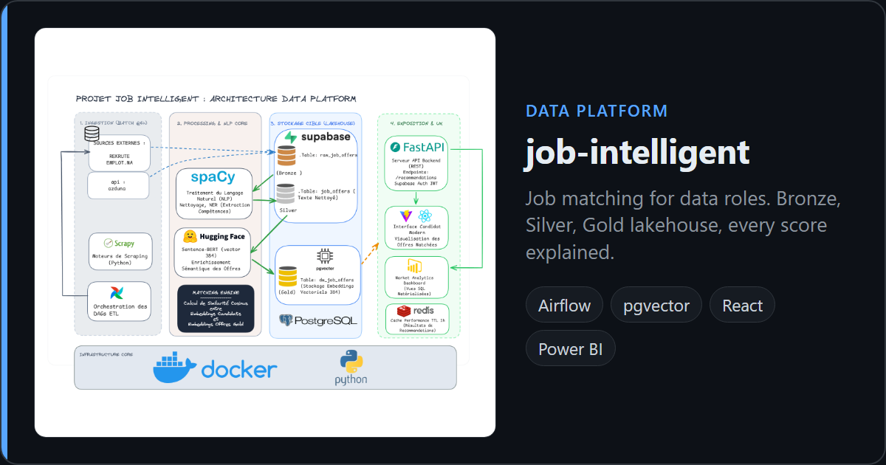
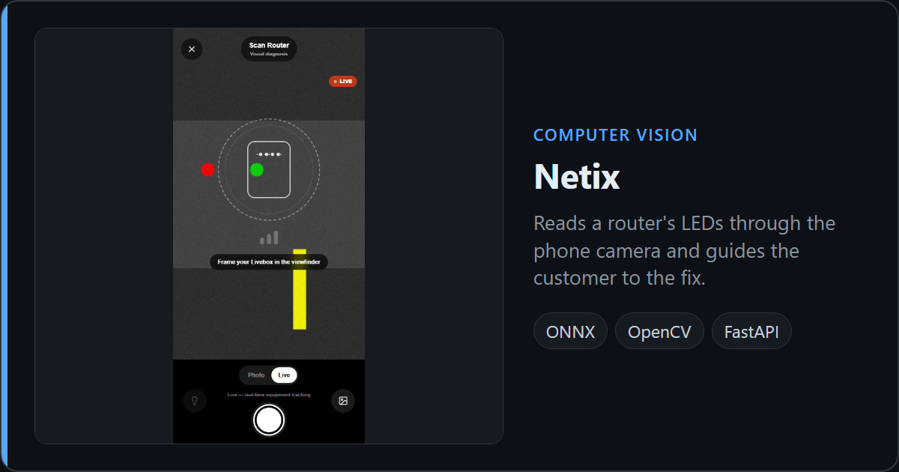
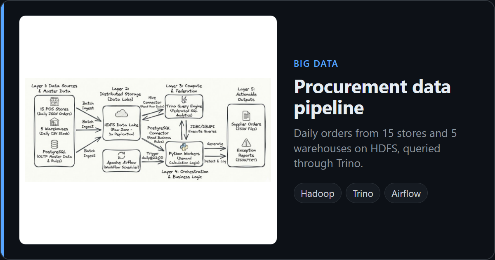
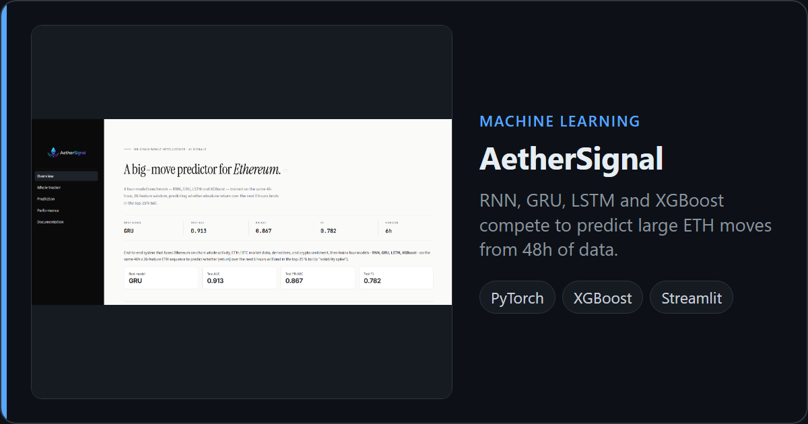

## Mohamed Amine El Abidi

Data and AI engineer in Rabat. I build agents that do real work, retrieval that cites its sources, and the pipelines underneath. Currently at Upfund on Vertex AI agents and a FastAPI backend on GCP.

 

## Projects

<table>
<tr><td width="50%"></td><td width="50%"></td></tr>
<tr><td width="50%"></td><td width="50%"></td></tr>
<tr><td width="50%"></td><td width="50%"></td></tr>
</table>

More: [career-pipeline](https://github.com/mohamedamineelabidi/career-pipeline) · [Litflow-backend](https://github.com/mohamedamineelabidi/Litflow-backend) · [realestate-rag](https://github.com/mohamedamineelabidi/realestate-rag) · [AirflowLab](https://github.com/mohamedamineelabidi/AirflowLab)

## Stack

Python · SQL · FastAPI · LangGraph · PostgreSQL · Qdrant · Kafka · Spark · Airflow · dbt · Docker · GCP · Azure

## Contact

elabidimohamedamine@gmail.com · [LinkedIn](https://www.linkedin.com/in/maelabidi/)
